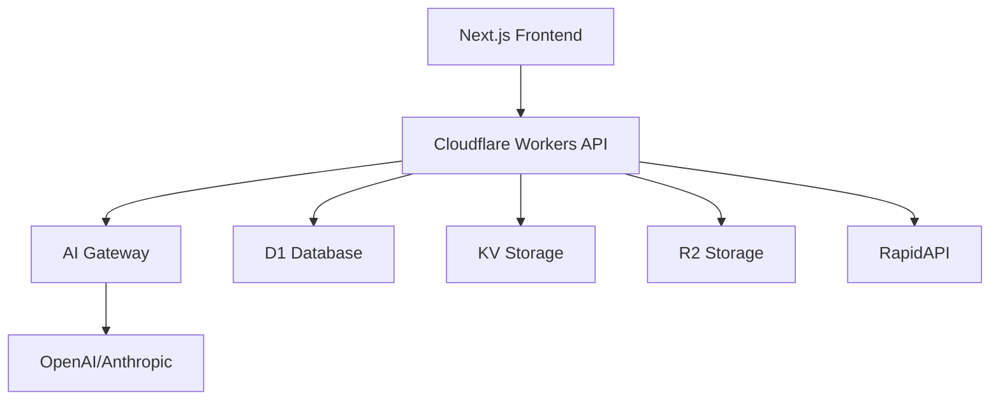

# 🤖 laddrressa.ai - AI-Powered Local Business Discovery

[](https://github.com/username/laddrressa-ai/actions/workflows/deploy.yml)
[](https://opensource.org/licenses/MIT)
[](https://typescriptlang.org)

> 🚀 **AI-powered SaaS platform for intelligent local business discovery and analytics**

Built on Cloudflare's edge infrastructure with modern AI/RAG technology, serving both B2C consumers and B2B enterprises.

## 🌟 Features

- **🧠 AI-Powered Search** - Natural language business discovery
- **🌍 Global Coverage** - Local businesses worldwide via RapidAPI
- **⚡ Edge Computing** - Sub-50ms response times globally
- **🔒 Enterprise Security** - MFA, SOC 2, GDPR compliant
- **📊 Advanced Analytics** - Business intelligence and insights
- **🔌 Developer APIs** - RESTful APIs with comprehensive SDKs

## 🏗️ Architecture



### Tech Stack

- **Frontend**: Next.js 14, Tailwind CSS, Shadcn UI
- **Backend**: Cloudflare Workers, Hono.js
- **Database**: Cloudflare D1 (SQLite), KV Storage
- **AI/ML**: OpenAI GPT-4, Anthropic Claude, Vector embeddings
- **Auth**: Clerk with MFA (SMS, TOTP, WebAuthn)
- **Payments**: Stripe
- **Deployment**: Cloudflare Pages + Workers

## 🚀 Quick Start

### Prerequisites

- Node.js 18+
- pnpm (recommended)
- Cloudflare account
- Git

### Installation

```bash
# Clone the repository
git clone https://github.com/username/laddrressa-ai.git
cd laddrressa-ai

# Install dependencies
pnpm install

# Copy environment variables
cp .env.example .env.local

# Start development server
pnpm dev
```

### Environment Setup

```bash
# Cloudflare
CLOUDFLARE_ACCOUNT_ID=your_account_id
CLOUDFLARE_API_TOKEN=your_api_token

# Authentication (Clerk)
NEXT_PUBLIC_CLERK_PUBLISHABLE_KEY=pk_test_...
CLERK_SECRET_KEY=sk_test_...

# AI Services
OPENAI_API_KEY=sk-...
ANTHROPIC_API_KEY=sk-ant-...

# External APIs
RAPIDAPI_KEY=your_rapidapi_key

# Payments (Stripe)
STRIPE_SECRET_KEY=sk_test_...
NEXT_PUBLIC_STRIPE_PUBLISHABLE_KEY=pk_test_...
```

## 📁 Project Structure

```
laddrressa-ai/
├── apps/
│   ├── web/                 # Next.js frontend
│   ├── api/                 # Cloudflare Workers API
│   └── docs/                # Documentation site
├── packages/
│   ├── ui/                  # Shared UI components
│   ├── database/            # Database schema & migrations
│   ├── auth/                # Authentication utilities
│   └── ai/                  # AI/RAG utilities
├── docs/
│   └── wiki/                # Project documentation
├── scripts/
│   ├── setup.sh            # Development setup
│   └── deploy.sh           # Deployment scripts
└── .github/
    └── workflows/           # CI/CD pipelines
```

## 🛠️ Development

### Available Scripts

```bash
# Development
pnpm dev                     # Start all services
pnpm dev:web                 # Frontend only
pnpm dev:api                 # Workers only

# Testing
pnpm test                    # Run all tests
pnpm test:unit              # Unit tests
pnpm test:e2e               # E2E tests

# Building
pnpm build                   # Build all apps
pnpm build:web              # Build frontend
pnpm build:api              # Build Workers

# Database
pnpm db:generate            # Generate migrations
pnpm db:deploy              # Deploy to D1
pnpm db:studio              # Database GUI

# Deployment
pnpm deploy                 # Deploy to production
pnpm deploy:staging         # Deploy to staging
```

### Development Workflow

1. **Feature Branch**: Create from `main`
2. **Development**: Use `pnpm dev` for local development
3. **Testing**: Run `pnpm test` before committing
4. **Pull Request**: Submit for review
5. **Deploy**: Automatic deployment on merge

## 📊 Subscription Tiers

### B2C Plans
- **Free**: 10 searches/month
- **Pro**: $9/month - 100 searches + AI insights
- **Premium**: $29/month - Unlimited + API access
- **Premium+**: $79/month - White-label + advanced features

### B2B Plans
- **Starter**: $49/month - 5 team members, 500 searches
- **Growth**: $149/month - 25 members, 2,500 searches
- **Enterprise**: $449/month - Unlimited everything

## 🔐 Security

- **Authentication**: Clerk with mandatory MFA
- **Authorization**: Role-based access control (RBAC)
- **Data Protection**: End-to-end encryption
- **Compliance**: SOC 2, GDPR, ISO 27001
- **Infrastructure**: Cloudflare security stack

## 📈 Performance

- **Global CDN**: 300+ edge locations
- **Response Time**: <50ms (95th percentile)
- **Uptime**: 99.99% SLA
- **Scalability**: Auto-scaling serverless

## 🤝 Contributing

1. Fork the repository
2. Create a feature branch (`git checkout -b feature/amazing-feature`)
3. Commit changes (`git commit -m 'Add amazing feature'`)
4. Push to branch (`git push origin feature/amazing-feature`)
5. Open a Pull Request

### Code Standards

- **TypeScript**: Strict mode enabled
- **ESLint**: Airbnb configuration
- **Prettier**: Automatic formatting
- **Commitizen**: Conventional commits

## 📚 Documentation

- [📖 Full Documentation](./docs/wiki/README.md)
- [🏗️ Architecture Guide](./docs/wiki/architecture.md)
- [🎨 Design System](./docs/wiki/interface-design.md)
- [🔑 Authentication](./docs/wiki/authentication.md)
- [💳 Subscription Models](./docs/wiki/subscription-models.md)
- [🔌 API Reference](./docs/wiki/api-documentation.md)

## 🌐 Live Demo

- **Production**: [https://laddrressa.ai](https://laddrressa.ai)
- **Staging**: [https://staging.laddrressa.ai](https://staging.laddrressa.ai)
- **API Docs**: [https://docs.laddrressa.ai](https://docs.laddrressa.ai)

## 📞 Support

- **Documentation**: [docs.laddrressa.ai](https://docs.laddrressa.ai)
- **Issues**: [GitHub Issues](https://github.com/username/laddrressa-ai/issues)
- **Email**: support@laddrressa.ai
- **Discord**: [Join Community](https://discord.gg/laddrressa)

## 📄 License

This project is licensed under the MIT License - see the [LICENSE](LICENSE) file for details.

## 🙏 Acknowledgments

- [Cloudflare](https://cloudflare.com) for edge infrastructure
- [OpenAI](https://openai.com) for AI capabilities
- [Clerk](https://clerk.dev) for authentication
- [Stripe](https://stripe.com) for payments

---

**Built with ❤️ by [Consultant Infonuagique](https://consultantinfonuagique.com)**

*Started: September 2025 | Phase: Foundation*